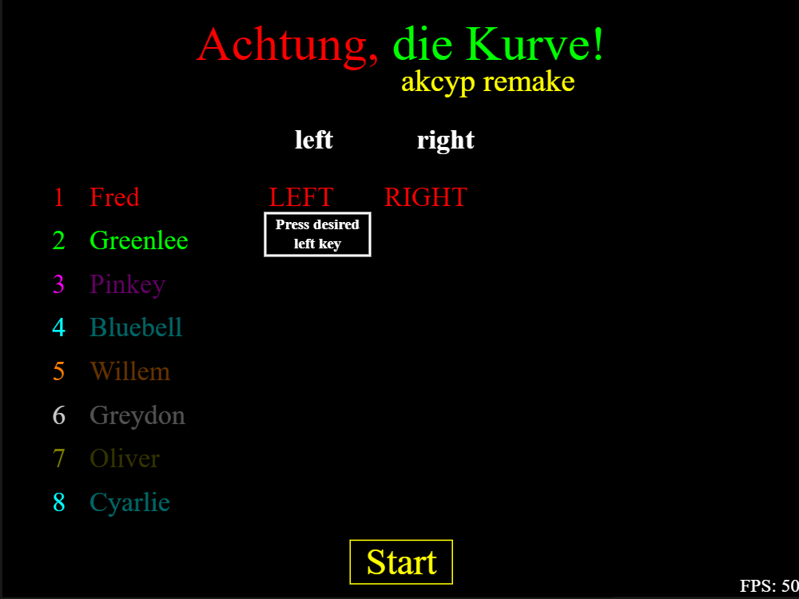
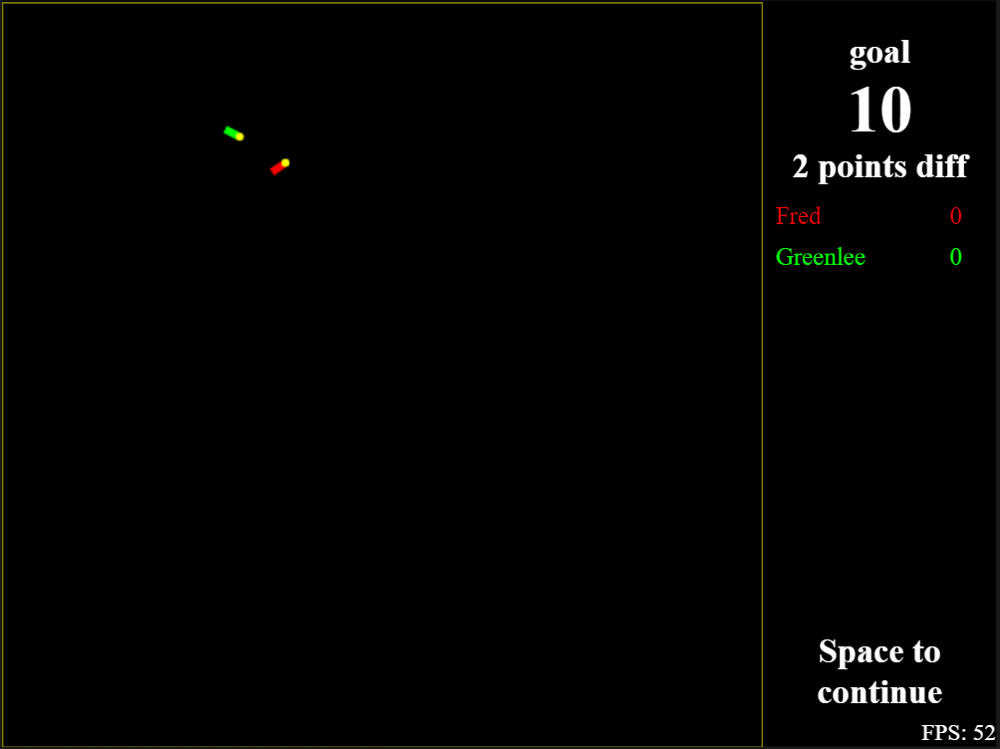

# Achtung die kurve written in javascript

## Download

### 1. Clone from github repository

```bash
git clone git@github.com:akcyp/html5-kurve-game.git
```

### 2. Go to directory

```bash
cd html5-kurve-game
```

### 3. Install npm dependencies

```bash
npm i
```

## To run, type in console

```bash
npm run start
```



